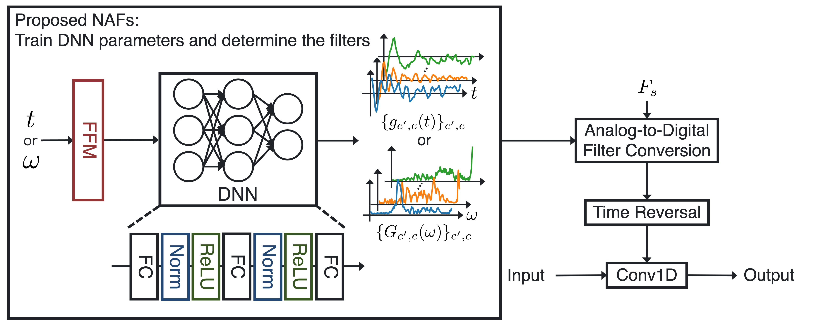

# Neural Analog Filter (NAF) for Sampling-Frequency-Independent (SFI) Convolutional Layer

[**Paper**](http://dx.doi.org/10.1561/116.20230082)

This repository is an official implementation of our paper entitled "Neural Analog Filter for Sampling-Frequency-Independent Convolutional Layer" for speech separation.
For music source separation, please see [here](https://github.com/Kanami-Imamura/Neural_Analog_Filter_music_source_separation).

<p align="center">
  
</p>
Architecture of SFI convolutional layer using conventional filters and proposed NAFs.

## Abstract
A sampling-frequency-independent (SFI) convolutional layer is an extension of a convolutional layer to handle various sampling frequencies (SFs) with a single deep neural network (DNN). The SFI convolutional layer treats a standard convolutional layer as a collection of digital filters designed from analog filters. Analogous to the analog-to-digital filter conversion, it generates the weights from an SFI structure (latent analog filter) with respect to an input SF. To use the SFI layer, we need to define the mathematical forms of the latent analog filters before training. However, it is difficult to manually define the appropriate forms for an arbitrary network architecture. The inappropriate definition can result in the performance degradation. To overcome this problem, we propose a neural representation of analog filters, which can determine the forms of the latent analog filters in an end-to-end manner. The proposed method treats the latent analog filter as a function of continuous time or frequency and represents it using a DNN. Music source separation and speech separation experiments showed that the proposed method outperformed manually designed latent analog filters.

## Implementation overview
We implemented our model based on [aseteroid](https://github.com/asteroid-team/asteroid).
Our proposed NAF, and the conventional methods, SFI convolutional layer and SFI Conv-TasNet, are implemented in `asteroid/asteroid_filterbanks/naf_fb.py`, `asteroid/asteroid_filterbanks/sfi_enc_dec.py`, and `asteroid/models/sfi_conv_tasnet.py`.
For implementing the SFI convolutional layer and SFI Conv-TasNet, we used https://github.com/TomohikoNakamura/sfi_convtasnet as a reference.
We also added the [recipe](egs/vctk_2mix/SFIConvTasNet) for training and evaluating our models.

## How to use
### Setup
You can setup with docker or conda.
#### docker
First, construct docker container and go into it.
```bash
cd sfi_docker
docker compose up --build -d
docker compose exec core bash
```
Then, install requried packages.
```bash
pip install -e .
```

#### conda
```bash
conda env create -f environment.yml
conda activate asteroid
```

### Training model
Please use the [recipe](egs/vctk_2mix/SFIConvTasNet/) for training the models.

# How to cite
```
@article{KImamura2024ATSIP,
  author={Imamura, Kanami and Nakamura, Tomohiko and Yatabe, Kohei and Saruwatari, Hiroshi},
  journal = {APSIPA Transactions on Signal and Information Processing},
  title = {Neural Analog Filter for Sampling-Frequency-Independent Convolutional Layer},
  year=2024,
  month=nov,
  volume=13,
  number=1,
  doi={10.1561/116.20230082}
}
```

# License
[MIT License](LICENSE)

# Achknowledgements
- This work was supported by JSPS KAKENHI under Grant JP23K28108 and JST ACT-X under Grant JPMJAX210G.
- Most part of this code is borrowed from https://github.com/asteroid-team/asteroid and https://github.com/TomohikoNakamura/sfi_convtasnet.
